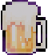
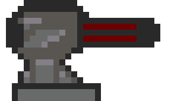
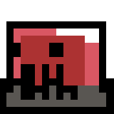
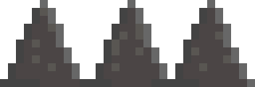
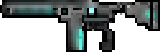

# 🍺 Beer

### [🔗 Click here to play!](https://laurenstuerk.github.io/CCL1/)

Embark on a beer-fueled quest to reclaim your stolen stash from the notorious Radler Gang.
Explore, unlock new abilities, and defeat enemies to quench your thirst and restore order to the land.

> **A Beer-Soaked Adventure!**  
> Join our hero on an epic pixel-art platformer journey to reclaim his stolen beer from the villainous Radler Gang. Battle enemies, explore mysterious caves, and uncover the divine power of the Holy Draught!

---

## 🍻 Story Summary

One fateful morning, our hero wakes up. His beer stash is **gone**! The notorious **Radler Gang** has stolen every last drop, corrupting the land with their watered-down abominations. Fueled by rage (and thirst), he embarks on a quest to recover his beloved brew.

Along the way, he discovers the legendary **Holy Draught**, meets **God**, and is entrusted with a sacred mission: to infiltrate the **Radler Factory** and turn their fake beer into a downpour of **real booze**.

---

## 🕹️ Gameplay Features

✔️ Classic **2D pixel platformer** action!  
✔️ A variety of **enemies, traps, and obstacles** to overcome.  
✔️ **Explore** caves, factories, and sacred lands in your quest for beer.  
✔️ **Humorous cutscenes** featuring beer gods and pure adventure.

---

## 📸 Screenshots

### Main Gameplay:

Figure 1: Gameplay screenshot

    
    
Gameplay screenshot.

---

### The Holy Beer:

  

## 🎨 Art & Sprites

### Main Character:

    
    

### GungTower: Monster:

    
    
    
    
    
    

---

## 🚀 How to Play

- **Move:** A & D
- **Jump:** Spacebar
- **Shoot:** Left Click

---

## 🔧 Development Details

- **Tools Used:**
1. MapperMate for level design,
2. LibreSprite for pixel art,
3. ElevenLabs for voice and sound fx,
4. Blender for the rest 

---

## ✍️ Reflection

### What Went Well

✔ The pixel-art style and comedic theme made the game fun and engaging.  
✔ The cutscenes added a unique storytelling touch, making the journey more immersive.  
✔ Implementing all game game objects

### Challenges Faced

⚠️ Tweaking movement physics to feel responsive and smooth.

⚠️ Level Management to switch between levels and watch corresponding Cutscene

⚠️ 

### Lessons Learned

📌 **Keep it simple!** Focus on a strong core mechanic rather than overcomplicating features.  
📌 **Story matter!** Even a silly story becomes immersive with good pacing and visuals.  
📌 **Humor and gameplay go hand in hand.** A unique theme makes a game stand out.

---

## 🍹 Final Words

**Beer** was a blast to create! I hope you enjoy playing it as much as i enjoyed making it. Now go forth, reclaim the beer, and **let it rain!** 🍺🎉

### 🌀 3D Model Preview

🔗 [Click to view the interactive 3D model on Sketchfab!](https://sketchfab.com/3d-models/character-af271d4f37f84bbfb3186c1beb5ff872)
