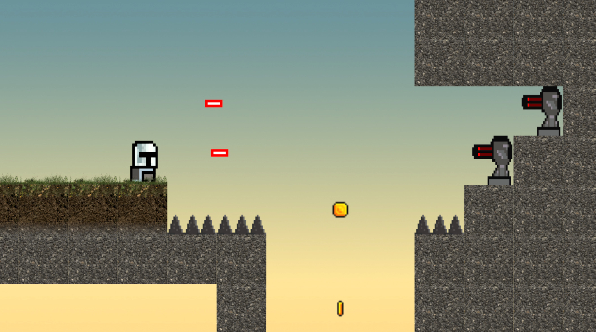

# 🍺 Beer

### [🔗 Click here to play!](https://laurenstuerk.github.io/CCL1/)

Embark on a beer-fueled quest to reclaim your stolen stash beer from the notorious Radler Gang.
Explore, unlock new abilities, and defeat enemies to quench your thirst and restore order to the land.

Join our hero on an epic pixel platformer journey!🧔

---

## 🍻 Story Summary

One fateful morning, our hero wakes up. His beer stash is **gone**! The notorious **Radler Gang** has stolen every last drop, corrupting the land with their watered-down abominations. Fueled by rage (and thirst), he embarks on a quest to recover his beloved brew.

Along the way, he discovers the legendary **Holy Draught**, meets **God**, and is entrusted with a sacred mission: to infiltrate the **Radler Factory** and turn their fake beer into a downpour of **real booze**.

---

## 🕹️ Gameplay Features

✔️ Classic **2D pixel platformer** action!  
✔️ A variety of **enemies, traps, and obstacles** to overcome.  
✔️ **Humorous cutscenes** featuring beer god and pure adventure.

---

## 📸 Screenshots

### Main Gameplay:

    
    
Main Menu

    
    
Gameplay screenshot
 
    
    
Game Over

## 🎨 Art & Sprites

### Main Character:

    
    

    
        
Guntower

    
            
Monster

        
            
Holy Beer

    
            
Spike

    
            
Mine

    
            
Gun
  

---

## 🚀 How to Play

- **Move:** A & D
- **Jump:** Spacebar
- **Shoot:** Left Click

---

## 🔧 Development Details

- **Tools Used:**
1. MapperMate for level design,
2. LibreSprite for pixel art,
3. ElevenLabs for voice and sound fx,
4. Blender for the rest 

---

## ✍️ Reflection

### What Went Well

✔ **The pixel-art** style and comedic theme made the game fun and engaging.  
✔ **The cutscenes** added a nice storytelling touch.
✔ Implementing all game game objects           

### Challenges Faced

⚠️ **Tweaking movement** physics to feel responsive and smooth
⚠️ **Level Management** to switch between levels and watch corresponding Cutscene
⚠️ **Debugging** unexpected player interactions and collisions.
⚠️ **Creating enough variety** in levels while keeping the core mechanics engaging.

### Lessons Learned

📌 **Keep it simple!** Focus on a strong core mechanic rather than overcomplicating features.  
📌 **Story matter!** Even a silly story becomes immersive with good pacing and visuals.  
📌 **Humor and gameplay go hand in hand.** A unique theme makes a game stand out.
📌 **Music and sound effects** play a huge role in setting the game’s mood.

---

### 🌀 3D Model Preview

🔗 [Click to view the interactive 3D model on Sketchfab!](https://sketchfab.com/3d-models/character-af271d4f37f84bbfb3186c1beb5ff872)

## 🍹 Final Words

**Beer** was a blast to create! I hope you enjoy playing it as much as i enjoyed making it. Now go forth, reclaim the beer, and **let it rain!** 🍺🎉
